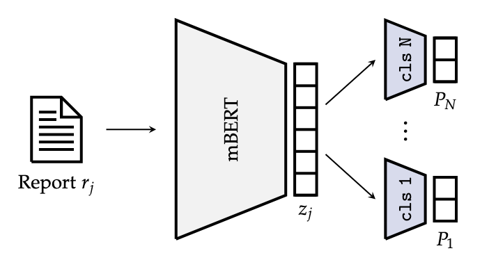

# Master Thesis: Continual Learning for Multilingual Sequence Labelling

This repository contains code to train and evaluate classification models in a multilingual continual learning setting, along with utility code to process and analyse the radiology report data used in this study.

## Setup
A list of the python packages required to use this code can be found in the `requirements.txt` file. In particular, the deep learning framework used is PyTorch, and the code relies on the tranformer models implemented and pretrained in the [Hugging Face transformers library](https://huggingface.co/docs/transformers/index).

Before running the code:
```bash
python3 -m venv venv
source ./venv/bin/activate
pip install --upgrade pip wheel
pip install -r ./requirements.txt
```

## Structure
The repository contains the following folders:
* `resources`: contains documentation resources for this project (images, etc.);
* `src`: contains the code to train and evaluate classification models;
* `utils`: contains a package to handle datasets, log files, etc... A more detailed description can be found in the directory's README.

## Training a model

The framework allows to train and evaluate multilingual BERT in a shared encoder architecture (i.e. in a single- or multi-task binary classification setting):



The supported continual learning techniques are [Elastic Weight Consolidation](https://doi.org/10.1073/pnas.1611835114), [Knowledge distillation](http://dx.doi.org/10.18653/v1/2021.acl-short.106), and a novel approach based on machine translation.

To train a model use the following command:
```bash
python3 src/train.py -c config.yaml
```

### Input data format

For each binary classification task, a `csv` file, named `<label_id>_data.csv`, with the following structure is expected: 

| text         | label    |
| ------------ | -------- |
| input text 1 | 0        |
| input text 2 | 1        |
| ...          | ...      |

The input files for all tasks must be stored in the same directory, which will then be provided in the configuration file along with the task identifiers to be loaded for the model.
See [this directory](src/example_input_data) for a minimum complete example.
Optionally, for the machine translation method, one needs to be able to identify the same report in two different languages, hence a "report id" column may be added.
This and all other columns are ignored where not relevant.
See Section [Examples](#examples) for more details and examples.

### Config files
The training configuration file ([example](src/config.yaml)) contains the following sections:
* **`gpu_list`**: list of GPU ids to use for training
* **`experiment_config`**: configures metadata for the experiment (`experiment_name` and `experiment_id`) along with the output
path;
* **`trainer`**: configures the training process, which includes the number of epochs, early stopping, and training restart.
When incrementally training on new datasets, `cl_incremental_training` should be set to true. `monitor` is used for model
selection and early stopping; possible values are combinations of `[max, min]` and `[f1_score, acc, prec, rec, loss]`, depending
on the metric the model selection is to be performed on and whether this should be maximized or minimized. To disable early
stopping use `early_stop: -1`;
* **`optimizer`**: configures the optimizer to use for training. The type of the root optimizer should in general not be changed,
whereas under `args:opt_configs:type` one can specify any PyTorch optimizer (configured using the `args`). The special option
`lr_opts` is used to set different learning rates for different parameter groups inside the model; the `layer_type` is matched
against the parameter names returned by `torch.module.get_named_parameters()` allowing to achieve different levels of granularity
(e.g. `transformer` will include all parameters in the shared encoder, whereas `transformer.encoder.layer.2` matches all weights
in the second layer of the shared encoder; the classifiers are named as `classifier_<label_id>`);
* **`lr_scheduler`**: PyTorch learning rate scheduler to use; the step method is called at the end of each training epoch;
* **`loss`**: loss function used for training. See the [loss module](src/model/loss.py) for all available options;
* **`model`**: Model architecture specification.
`ClassificationModel` corresponds to the shared encoder architecture with as
many classification heads as labels listed in `experiment:label_code_opts`. The `model:args:model_path` argument corresponds to
the BERT architecture of the shared encoder (this can be either a local file path or a model name available on the huggingface
model repository). Currently, only BERT architectures are supported (e.g. `bert-base-multilingual-cased`, `bert-large-uncased`, etc.), so it is not possible to train on e.g. distilBERT or RoBERTa.
The matching of the named parameters listed under the optional argument `model:args:freeze_layers` is
equivalent to the one described in `args:opt_configs:lr_opts`;
* **`data_loader`**: configures the loading of the training data, depending on the chosen training technique.
A different data loader is required for training with knowledge distillation and machine translated data + regularization.

### Model evaluation

To evaluate a model trained using `<experiment_name>` and `<experiment_id>`:
```bash
python3 src/evaluate.py -i <input_dir> -o <out_dir> -x <experiment_name>/<experiment_id> -t <tokenizer_path> -k -e
```

For detailed information on each parameter run:
```bash
python3 src/evaluate.py -h
```

## Examples

Here we provide minimum working examples for all continual learning techniques implemented in this library.
We assume the goal is to train models in a language-incremental fashion, hence here `data_1` and `data_2` refer to two datasets containing text written in two different languages.
The dummy data and example configuration files are found in the [`examples` folder](examples).

### Training a single model

We start by training a model on dataset [`data_1`](examples/data_1) with experiment name `example` and ID `0`:
```bash
python3 src/train.py -c examples/config_example.yaml
```
The output model will be stored under the `output/models/example/0/model_best-.pth`.

### Incremental training

To train the previous example model incrementally (without any special techniques) on [`data_2`](examples/data_2), with experiment name `example_incremental` and ID `0`, configure hyperparameters for this second training run and resume training of the model above with the new configuration, reloading the previous checkpoint:
```bash
python3 src/train.py -c examples/config_example_incremental.yaml -r output/models/example/0/model_best-.pth
```
The final model, which has now been trained on datasets data_1 and data_2, is stored in `output/models/example_incremental/0/model_best-.pth`.

### Elastic Weight Consolidation (EWC)

To train the first example model incrementally on [`data_2`](examples/data_2) using EWC, configure hyperparameters for this second training run and resume training of the model above with the new configuration, reloading the previous checkpoint:
```bash
python3 src/train.py -c examples/config_example_ewc.yaml -r output/models/example/0/model_best-.pth
```
The final model, which has now been trained on datasets [`data_1`](examples/data_1) and [`data_2`](examples/data_2), is stored in `output/models/example_ewc/0/model_best-.pth`.

In the `ewc` configuration in the [example configuration file](examples/config_example_ewc.yaml), we specify the data on which we want to compute the EWC coefficients (usually from [`data_1`](examples/data_1)) and the importance given to the quadratic penalty described by this method (`lambda`).

### Knowledge distillation (KD)

First, we need an unlabelled dataset to use for knowledge distillation ([`data_unlabelled`](examples/data_unlabelled)), to which we provide some dummy labels (required by the evaluation script).
We extract the predictions of model `example/0` (weak supervision) for this data using the evaluation script:
```bash
python3 src/evaluate.py -i examples/data_unlabelled -o output -x example/0 -t bert-base-multilingual-cased -k
```
This will store the dataset we just labelled under `output/evaluation/example/0/examples_data_unlabelled/`, with prediction probabilities under the `pred` column.
We will use this along with [`data_2`](examples/data_2) during incremental training with KD:
```bash
python3 src/train.py -c examples/config_example_kd.yaml -r output/models/example/0/model_best-.pth
```
The specific configuration in this step lies in the data loader, which is now of type `KDDataLoader`.
Here we specify the labelled training data ([`data_2`](examples/data_2)), along with the weakly labelled data (`kd_data_dir`).
Additionally, a special loss function is used to handle the two distinct cross-entropy losses used for the labelled and weakly labelled data (different weights for each component are specified by the `lambda` parameter).

Again, the final model, a copy of its configuration and the best model checkpoint are found in `output/models/example_kd/0/model_best-.pth`.

### Machine translation + regularization

When incremental training occurs on datasets in two different languages, one can use this method to potentially boost performance.
After training the first model on [`data_1`](examples/data_1) as above, we translate the dataset to the language of [`data_2`](examples/data_2), obtaining [`data_translated`](examples/data_translated).

We extract the latent document vectors for [`data_1`](examples/data_1) from the model `example/0` using the evaluation script:
```bash
python3 src/evaluate.py -i examples/data_1/train -o output -x example/0 -t bert-base-multilingual-cased -e
```
This will store the document embeddings tensors of the model and the metadata under `output/evaluation/example/0/embeddings/embeddings/00000/example_data_1_train/`.

Next we need to put together the translated text data and these embeddings:
```bash
cd utils
python3 -m main -e transfer_embeddings -i ../examples/data_1/train
Translated data input directory? 
>>> ../examples/data_translated
Embedding directory?
>>> ../output/evaluation/example/0/embeddings/00000/examples_data_1_train/
Sample identifier column?
>>> id

cd ../
```
The complete training data for this step is then stored in examples/data_1/parallel.

Now, we can incrementally fine-tune the model example/0 with the correct configuration:
```bash
python3 src/train.py -c examples/config_example_mt.yaml -r output/models/example/0/model_best-.pth
```
where the config file specifies the EmbeddingDataLoader and the L2Loss function on the embeddings, along with the WeightedBCELoss.

Finally, the resulting model can be fine-tuned on data_2 as specified in Section [Incremental training](#incremental-training).